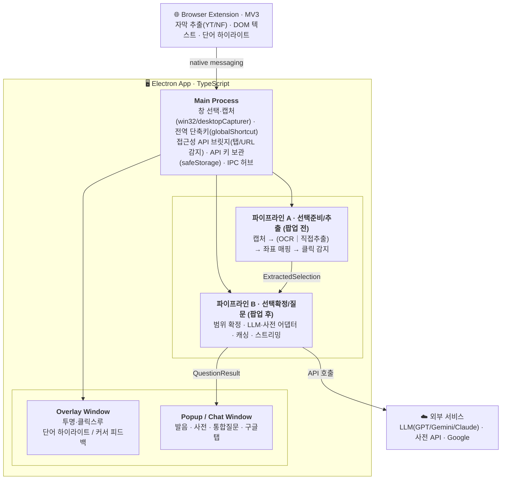

# Nuance — 외국어 콘텐츠 소비 보조 프로그램 · 기획서

## 목차

1. [개요](#1-개요)
2. [대상 콘텐츠](#2-대상-콘텐츠)
3. [사용 흐름](#3-사용-흐름)
4. [핵심 기능](#4-핵심-기능)
5. [기술 아키텍처](#5-기술-아키텍처)
6. [까다로운 부분 & 해결 전략](#6-까다로운-부분--해결-전략)
7. [2인 분업 계획 (파이프라인 축)](#7-2인-분업-계획-파이프라인-축)
8. [리스크 & 확장 로드맵](#8-리스크--확장-로드맵)
9. [프로젝트 구조 (스캐폴드)](#9-프로젝트-구조-스캐폴드)

## 1. 개요

**한 줄 소개**: 화면 위 어떤 외국어 텍스트든 클릭 한 번으로, 그 맥락에 맞는 발음·뜻·뉘앙스를 즉시 알려주는 데스크톱 오버레이 도구.

**문제의식**: 외국어 원서·영상·웹소설·만화를 소비할 때, 모르는 표현을 만나면 뷰어를 벗어나 사전/번역기로 이동해야 하고, 사전은 그 **문맥 속 의미**를 짚어주지 못한다. `read`의 발음, `後`의 독음, 어떤 뜻으로 쓰였는지는 문맥이 있어야 안다.

**목표**: 사용자가 보고 있는 창 위에 투명 오버레이를 띄워, 콘텐츠를 벗어나지 않고 단어를 클릭 → 문맥 인지형 LLM 답변을 받는 경험을 제공한다. 텍스트를 직접 추출할 수 있으면 추출하고, 불가능하면(스캔본·이미지 전자책) OCR로 대응한다.

**지원 범위**: 한국어 모어 화자 대상 / 영어·일본어·중국어 지원(추후 확장) / Windows·macOS.

## 2. 대상 콘텐츠

| 채널 | 대상 | 텍스트 확보 방식 |
|------|------|------------------|
| 데스크톱 | txt/epub 뷰어 | 원본 파일 직접 추출 |
| 데스크톱 | PDF 뷰어 | 추출 시도 → 텍스트 양으로 판정(적으면 OCR) |
| 데스크톱 | Kindle/Apple Books(전자책 뷰어) | 접근성 API로 렌더 텍스트 추출 시도 → 실패 시 OCR |
| 데스크톱 | 스캔 소설·만화 | OCR |
| 브라우저 | 유튜브 | URL 기반 원어 자막 추출 |
| 브라우저 | 넷플릭스 | 확장 프로그램으로 현재 에피소드 원어 자막 추출 |
| 브라우저 | 웹소설·웹툰·일반 웹페이지 | 확장으로 DOM 텍스트 추출 → 부족하면 OCR |

## 3. 사용 흐름

1. **실행** → 중앙에 큰 [창 선택] 버튼 + 우측 상단 작은 [설정] 아이콘.
2. **창 선택** (Zoom 화면공유처럼 창 목록에서 선택) → 앱이 해당 창 화면을 볼 수 있음 → 백그라운드 실행.
   - 선택된 창 테두리 색 표시: **일반 모드 = 파란색 / 선택 모드 = 보라색**.
   - 백그라운드 아이콘 클릭 시: 창 선택 해제 / 창 재선택 / 설정.
3. **모드 전환 단축키**로 일반 모드 ↔ 선택 모드 토글.
   - 일반 모드: 클릭에 개입하지 않음.
   - 선택 모드: 포커스된 창 위에 투명 오버레이 → 텍스트 클릭 가로챔.
4. **선택** → 근방 텍스트가 팝업으로 뜸 → 범위 지정 후 질문.
5. **질문** → 발음 / 사전 / 통합 질문(채팅형) / 구글 검색.

### 화면 구성 (UI 목업 기준)

**메인 화면**: 중앙에 큰 파란 [창 선택] 버튼 + "사용할 창을 선택하세요" 안내 + 우측 상단 작은 설정(톱니) 아이콘. 앱 아이덴티티 "Nu"/Nuance. Windows 11·macOS 네이티브 룩.

**설정 화면** (섹션 순서):
1. **LLM 선택** — GPT / Gemini / Claude 카드형 단일 선택(선택 시 체크 표시).
2. **API 키 관리** — 선택한 LLM의 키 입력, 보기(눈 아이콘)·수정·삭제. "안전하게 암호화 저장, 외부 미전송" 안내.
3. **단축키 설정** — 모드 전환(일반 ↔ 선택) 키 지정. 기본 예: `Alt+Q`, [변경] 버튼.
4. **AI 주변 범위(Byte)** — 프롬프트 제출 시 함께 넘길 앞뒤 텍스트 범위를 Byte 슬라이더(256·512·1024·2048·4096)로 지정. 미리보기에 "포함 제외 / 사용자 선택 영역 / 포함될 주변 범위"를 색으로 시각화.
5. **언어 선택** — 자동 언어 감지 / 직접 선택(영어·일본어·중국어). OCR 언어 설정.

**팝업 화면**: 상단에 선택된 원문 문맥 표시 → 툴바(LLM 아이콘 · [발음]·[사전 검색] 체크박스 · [입력](통합 질문) · [G 발음 검색]·[G 시각 자료 검색]) → AI 채팅 영역(질문/답변 말풍선 + "궁금한 내용을 입력하세요…" 입력창) → 하단 "자주 쓰는 질문" 목록(각 항목 [수정]; 예: 문법적 역할 / 문맥 속 의미 / 격식·객관 표현 여부).

## 4. 핵심 기능

### 4.1 선택 (Selection Pipeline)

**모드 전환**
- 선택 모드 진입 시 포커스된 창 위로 클릭스루 가능한 투명 오버레이 윈도우를 띄운다.
- 텍스트 영역 클릭 → 근방 텍스트 팝업. 텍스트 외 영역 클릭 → 일반 클릭으로 통과.

**단어 감지 & 시각 피드백**
- 각 단어의 화면 좌표(bounding box)를 확보 → 커서 좌표가 어느 단어에 해당하는지 판정.
- 선택 가능한 단어 위에 커서가 오면 커서 모양 변경. 브라우저(확장 있음)에서는 단어 주변에 사각형 하이라이트.

**팝업 내 범위 지정 (최소 단위)**
- 영어: 단어(공백 구분) 단위.
- 일본어·중국어: 문자 단위 세밀 선택.
- 클릭=단어 선택, 드래그=범위 선택 구분 → 클릭 이벤트를 mouseup에서 처리하여 드래그와 분리(세부 구현 미정, 프로토타이핑으로 확정).

**동작 구조(파이프라인)**
```
선택 모드 활성화
  → OCR 사용 여부 판정
     → (OCR 필요) 포커스 창 캡처 → 언어 특정(자동 감지 시 경량 분류/범용 OCR) → 언어 특화 OCR
     → (직접 추출) 소스별 텍스트 추출
  → 텍스트 추출 + 화면 좌표 매핑
  → 커서 좌표 ↔ 단어 매핑
  → 단어 클릭 감지 → 팝업 트리거 (ExtractedSelection = 근방 텍스트·단어 좌표·클릭 기준점을 B로 전달)   ← 여기까지 A (팝업 전)
  → [B] 팝업 내 범위 확정 → SelectionContext 생성 → 질문 파이프라인                                    ← 이후 B (팝업 후)
```

**OCR 사용 여부 판정 로직** — 원칙: "직접 추출을 먼저 시도하고, 확보 텍스트가 부족할 때만 OCR로 fallback".
- 유튜브·넷플릭스·txt 뷰어 → 직접 추출.
- Kindle·Apple Books 등 전자책 뷰어 → **접근성 API(macOS AX / Windows UIA)로 렌더된 텍스트 추출을 먼저 시도** → epub 임포트 등으로 원본 텍스트가 노출되면 직접 추출, DRM·이미지 렌더로 추출 불가하면 OCR. (Apple Books는 AX로 잘 노출, Kindle은 편차 있어 fallback 필수.)
- PDF 뷰어·기타 웹사이트 → 텍스트 추출 시도 후, 노출 텍스트 양이 많으면 직접 추출 / 통짜 이미지면 OCR.
- 스캔 소설·만화 → OCR.

**판정 시점**
- 선택 모드 진입 시 1회 판정하고 유지.
- 창 재선택 시 선택 모드 자동 해제.
- 같은 창에서 탭 URL이 바뀔 때마다 재판정(브라우저 탭 + PDF 뷰어 탭 포함).
  - 브라우저 내부 → 확장 프로그램 / 그 외 → 데스크톱 접근성 API로 URL·탭 변화 감지.
  - URL을 메인 구분 요소로 사용. 한 URL 내 OCR 여부 변화는 고려하지 않음.

### 4.2 질문 (Question Pipeline)

**LLM 채팅 팝업** (GPT / Gemini / Claude 선택)
- 하나의 팝업 = 하나의 대화 세션. 후속 질문이 이전 답변 맥락을 이어감.
- 인근 텍스트(설정 범위)를 문맥으로 함께 전달. 전체 맥락 텍스트는 **프롬프트 캐싱**으로 비용 절감(세부 미정).
- 팝업 툴바에서 **발음·사전 검색은 체크박스 토글**로 켜고, **통합 질문은 [입력]**, **구글 검색은 별도 버튼**([발음 검색]/[시각 자료 검색])으로 구성(§3 화면 구성 참고).

1. **발음** — 선택 텍스트의 발음기호(영: IPA / 일: 히라가나 / 중: 한어병음). **맥락 의존 발음**을 반영: `read`(현재/과거), `associate`(명·형/동), `後`(あと·ご·のち), `人気`(にんき·ひとけ), `得`(de·dé·děi), `行`(xíng·háng).
2. **사전 검색** — 선택 영역을 단어 단위 분해 → 사전 API로 각 단어 정보 획득 → 문맥과 함께 LLM에 전달 → LLM이 **해당 맥락에서 사전상 몇 번 뜻인지** 판정.
3. **통합 질문** — 자유 프롬프트. 자주 쓰는 질문을 사용자가 커스텀 등록·수정·삭제(예: 문맥 속 의미 / 문법적 역할 / 격식도·어투·뉘앙스 / 문장 구조).

**구글 검색** (팝업 속 팝업)
- 발음: "선택 텍스트 + Pronunciation/読み方/拼音" 구글 웹 탭.
- 시각 자료: 선택 텍스트 구글 이미지 탭.

## 5. 기술 아키텍처

**전 구간 TypeScript 단일 언어**로 두 사람의 코드 이동 비용을 낮춘다. 구성 요소별 스택:

- **앱**: Electron(메인 = Node, 렌더러·오버레이 = 웹) + TypeScript + React(렌더러 UI).
- **캡처/오버레이**: 창 열거·캡처는 Windows 네이티브 win32(user32/gdi32/dwmapi, `koffi` FFI 바인딩)를 우선 사용(가려진/최소화된 창까지 캡처) + 비-Windows는 `desktopCapturer` 폴백, 투명·클릭스루 BrowserWindow, `globalShortcut`.
- **OCR**: Tesseract.js(로컬) 또는 클라우드 OCR(정확도 우선 시) — 벤치 후 결정.
- **확장**: 브라우저 확장(Manifest V3) + native messaging.
- **API**: LLM 3종 어댑터(GPT/Gemini/Claude), 사전 API(언어별), 구글 웹/이미지 탭.
- **보안**: API 키는 Electron `safeStorage`로 로컬 암호화 저장.
- **언어 감지**: 자동 감지 + OCR 필요 시, 언어 특화 OCR 전에 경량 분류 모델 또는 범용 OCR로 언어를 먼저 특정.



## 6. 까다로운 부분 & 해결 전략


- **OCR 노이즈 제거**: 소설 제목·페이지 번호 등 불필요 텍스트를 **좌표 기반 규칙**(위치·반복성·정렬)으로 필터링 후 저장. 페이지 경계에 걸린 문장은 앞뒤 조각을 자연스럽게 이어붙임.
- **HTML 문단 잇기**: 태그는 제외하고 내부 텍스트만 이어 자연스러운 문단 구성.
- **직접 추출 vs OCR 구분**: PDF/HTML에서 추출 시도 → 텍스트 양으로 분기(위 4.1 로직).
- **판정 시점 캐싱**: URL을 키로 판정 결과를 유지, URL 변화 시에만 재판정.

## 7. 2인 분업 계획 (파이프라인 축)

두 사람을 **팝업창 기준**으로 나눈다. A는 팝업이 뜨기 전까지(창 선택·캡처·오버레이·모드·추출·좌표·클릭 감지), B는 팝업이 뜬 이후 전부(범위 확정·문맥 구성·질문·결과·설정)를 맡는다. **경계 = `ExtractedSelection`(A→B, 팝업 직전 추출 결과)와 `QuestionResult`(B→UI)**. 이 인터페이스를 가장 먼저 못박아 각자 목(mock)으로 병렬 개발한다.

### 담당 A — 선택 준비 & 추출 (팝업 전)
- 창 선택/화면 캡처(win32 네이티브 우선, desktopCapturer 폴백), 오버레이 윈도우, 전역 단축키, 모드 전환.
- OCR 파이프라인(캡처→언어 감지→언어 특화 OCR→좌표 매핑) + 노이즈 제거.
- 소스별 직접 추출(txt/epub/PDF) + 접근성 API(AX/UIA)로 전자책 뷰어 렌더 텍스트 추출, OCR 여부 판정 로직·판정 시점 캐싱.
- 브라우저 확장(DOM 텍스트, 유튜브/넷플릭스 자막, 단어 하이라이트) + 앱과 native messaging.
- 접근성 API로 탭/URL 변화 감지.
- 단어 hover 피드백·클릭 감지 → 팝업 트리거.
- **산출**: 클릭 시점의 `ExtractedSelection`(근방 텍스트 + 단어 좌표 + 클릭 기준점)을 B로 넘긴다(최종 선택 확정은 B가 팝업에서).

### 담당 B — 선택 확정 & 질문 (팝업 후)
- 팝업 내 범위 확정(영어=단어 / 일·중=문자, 클릭 vs 드래그) + 앞뒤 문맥 구성 → `SelectionContext` 생성.
- LLM 어댑터(GPT/Gemini/Claude 공통 인터페이스) + 채팅 세션·프롬프트 캐싱.
- 발음(맥락 발음), 사전 API 연동 + LLM 뜻 번호 판정, 통합 질문·커스텀 질문 관리.
- 구글 검색 탭(발음/이미지), 팝업·채팅 UI.
- 설정 화면(언어·LLM·API 키·단축키·인근 텍스트 범위).
- **입력**: `ExtractedSelection`을 받아 팝업에서 선택 범위를 확정(`SelectionContext` 구성)한 뒤 `QuestionResult`(스트리밍)를 UI에 렌더.

### 인터페이스 계약 (A ↔ B, 최우선 확정)
```ts
interface SelectionSource {              // 출처 메타(캐싱·자막 추출용)
  kind: 'youtube' | 'netflix' | 'pdf' | 'txt' | 'epub' | 'web' | 'ocr';
  url?: string;
  appName?: string;
}

// A가 팝업 직전에 생성해 B로 전달 (팝업 전까지가 A 경계)
interface ExtractedSelection {
  text: string;                         // 클릭 지점 근방의 추출 텍스트(문맥 포함)
  words: { text: string; bbox?: Rect }[]; // 단어 분해(+화면 좌표)
  anchorWordIndex: number;              // 사용자가 클릭한 단어 = 팝업 초기 선택 기준점
  language: 'en' | 'ja' | 'zh';         // 감지 또는 지정된 언어
  source: SelectionSource;
  extraction: 'direct' | 'ocr';         // 어떻게 뽑았는지
}

// B가 팝업에서 범위를 확정한 뒤 내부적으로 구성 (검색 함수 입력)
interface SelectionContext {
  selectedText: string;                 // 팝업에서 사용자가 최종 확정한 선택 범위
  language: 'en' | 'ja' | 'zh';
  precedingText: string;                // 앞 문맥(설정 범위만큼, 문장 경계까지 확장)
  followingText: string;                // 뒤 문맥
  words: { text: string; bbox?: Rect }[]; // 단어 분해(+화면 좌표)
  source: SelectionSource;
  extraction: 'direct' | 'ocr';
}

// B가 반환해 UI로 (스트리밍 가능)
type QuestionRequest =
  | { type: 'pronunciation' }
  | { type: 'dictionary' }
  | { type: 'ask'; prompt: string; history?: ChatTurn[] };

interface QuestionResult {
  kind: 'pronunciation' | 'dictionary' | 'ask';
  content: string;                      // 렌더용 마크다운/텍스트(스트리밍 청크)
  error?: QuestionError;                // 있으면 실패 결과. UI가 성공/실패를 구분하는 기준
  meta?: Record<string, unknown>;       // 발음기호, 사전 뜻 번호 등
}

// API 키 미설정/무효, 사용 한도(크레딧) 소진 등 UI가 구분해 안내해야 하는 실패 종류
type QuestionErrorCode =
  | 'no_active_provider' | 'no_api_key' | 'invalid_api_key'
  | 'insufficient_credit' | 'rate_limited' | 'network_error' | 'unknown';

interface QuestionError {
  code: QuestionErrorCode;
  message: string;                      // 렌더링용 완성된 한국어 문장
  provider?: LlmProvider;
}
```
- **통합 지점**: IPC 채널 `selection:extracted`(A→B, `ExtractedSelection` 전달 = 팝업 트리거), `question:request`/`question:stream`(B, 팝업에서 확정한 `SelectionContext` 기반). 양측 목 구현으로 병렬 진행하다 이후 실연결.
- **공유 코드**: 타입 정의(`shared/types.ts`), IPC 유틸, 로거는 공동 소유.

## 8. 리스크 & 확장 로드맵

- **리스크**: OCR 정확도/속도, 접근성 API의 OS별 편차(Win UIA vs macOS AX), 넷플릭스 자막 추출의 취약성, LLM 비용. → 관통 경로(직접 추출)를 먼저 확보해 데모 안정성 보장.
- **확장**: 지원 언어 추가, 학습 이력·단어장, 발음 TTS, 모바일.

## 9. 프로젝트 구조 (스캐폴드)

**빌드**: electron-vite(Vite 기반, main/preload/renderer 3개 번들 관리) + React + TypeScript. 파이프라인 A/B를 디렉터리로 분리해 §7 분업 경계를 코드 구조에 반영했다. `src/shared`(타입·IPC 채널)는 공동 소유.

```text
JoJo/
├── package.json                 # electron-vite 스크립트(dev/build/preview)
├── package-lock.json            # 의존성 트리 고정(npm ci)
├── electron.vite.config.ts      # main/preload/renderer 빌드 + 경로 alias
├── tsconfig.json                # 공통 TS 설정(@shared/@main/@renderer)
├── .env.example                 # [dev] MAIN_VITE_* API 키 템플릿(.env는 gitignore)
├── src/
│   ├── env.d.ts                 #   import.meta.env(MAIN_VITE_*) 타입 선언
│   ├── shared/                  # 🤝 공동 소유 — 인터페이스 계약(§7)
│   │   ├── types.ts             #   SelectionContext / QuestionResult / 에러 · 설정 타입
│   │   ├── channels.ts          #   IPC 채널 상수
│   │   └── languages.ts         #   언어별 정적 데이터 레지스트리(이름·구글 접미어 등)
│   ├── main/                    # Electron 메인 프로세스
│   │   ├── index.ts             #   진입점(윈도우·IPC·단축키 등록)
│   │   ├── windows.ts           #   메인/창선택 모달/오버레이/팝업 윈도우 팩토리
│   │   ├── ipc.ts               #   🤝 IPC 허브(A→B 연결점)
│   │   ├── keyStore.ts          #   [B] API 키 safeStorage 암호화 저장
│   │   ├── devSeed.ts           #   [dev] .env(MAIN_VITE_*) API 키 seed
│   │   ├── selection/          # 🅰️ 선택/추출 (담당 A)
│   │   │   ├── index.ts         #   선택 파이프라인 오케스트레이터
│   │   │   ├── shortcut.ts      #   모드 전환 전역 단축키(Alt+Q)
│   │   │   ├── capture.ts       #   창 목록/캡처(win32 우선, desktopCapturer 폴백) + 선택 창 id 보관
│   │   │   ├── win32Capture.ts  #   Windows 네이티브 창 열거·캡처(koffi FFI, 가려짐/최소화 대응)
│   │   │   ├── decideOcr.ts     #   OCR 사용 여부 판정 + URL 캐시
│   │   │   ├── extractDirect.ts #   소스별 직접 추출(txt/epub/pdf/web)
│   │   │   ├── ocr.ts           #   OCR 엔진 래퍼 + 노이즈 제거
│   │   │   ├── langDetect.ts    #   언어 자동 감지
│   │   │   └── accessibility.ts #   접근성 API(AX/UIA) 브릿지
│   │   └── question/           # 🅱️ 질문/AI (담당 B)
│   │       ├── index.ts         #   질문 라우터(발음/사전/통합질문)
│   │       ├── pronunciation.ts #   맥락 발음(IPA/히라가나/병음)
│   │       ├── dictionary.ts    #   사전 API + LLM 뜻 번호 판정
│   │       ├── google.ts        #   구글 발음/이미지 탭 URL
│   │       ├── errors.ts        #   질문 에러 메시지 단일 출처(한국어 문장화)
│   │       ├── prompts/         #   프롬프트 자원
│   │       │   ├── system.txt   #     문맥 질문 시스템 프롬프트
│   │       │   └── template.ts  #     {{key}} 플레이스홀더 치환 유틸
│   │       └── llm/             #   LLM 공통 어댑터 ✅ 구현 완료
│   │           ├── adapter.ts   #   provider 추상화 + 문맥 프롬프트 + 캐싱
│   │           ├── sse.ts       #   SSE 스트림 파서(공통)
│   │           ├── errors.ts    #   HTTP 상태코드 → QuestionErrorCode 분류
│   │           ├── gpt.ts       #   GPT
│   │           ├── gemini.ts    #   Gemini
│   │           └── claude.ts    #   Claude
│   ├── preload/
│   │   └── index.ts             #   🤝 contextBridge로 안전 API 노출
│   └── renderer/                # UI (React) — 공동, B 주도
│       ├── index.html
│       └── src/
│           ├── main.tsx, App.tsx        # 해시 라우팅(main/settings/popup/overlay/picker)
│           ├── env.d.ts                 # window.nuance(preload API) 타입 선언
│           ├── styles.css               # 테두리색(일반=파랑/선택=보라) 등
│           └── screens/
│               ├── MainScreen.tsx           # 창 선택 진입 + 선택 결과 표시
│               ├── WindowPickerScreen.tsx   # [A] 창 목록 그리드(별도 모달 창)
│               ├── SettingsScreen.tsx       # [B] LLM·키·단축키·Byte·언어
│               ├── PopupScreen.tsx          # [B] 원문·툴바·채팅·자주쓰는질문
│               └── Overlay.tsx              # [A] 단어 하이라이트/커서 피드백
└── extension/                   # 🅰️ 브라우저 확장(MV3) — 담당 A
    ├── manifest.json
    └── src/
        ├── background.ts        #   native messaging 브릿지 + 탭/URL 감지
        └── content.ts           #   DOM 텍스트·자막 추출 + 하이라이트
```

**시작 방법**: `npm install`(또는 `npm ci`) 후 `npm run dev`(electron-vite 개발 서버). 개발 중 LLM 키는 `.env`(`MAIN_VITE_*`)에 넣으면 `devSeed`가 keyStore에 주입한다. 확장은 `chrome://extensions`에서 `extension/`을 로드하고 native messaging host를 등록해야 함(추후 번들러 설정 TODO).

**표기**: 🤝 공동 소유 / 🅰️ 담당 A / 🅱️ 담당 B. **현황**: 담당 B의 LLM 어댑터·3종 클라이언트·스트리밍·에러 체계는 구현 완료(✅), 발음·사전·팝업/설정 UI는 스텁. 담당 A는 창 선택 UI(win32 창 열거·캡처 + 모달 피커)를 구현, 그 외 선택/추출·오버레이·확장은 스텁/진행 중. 항목별 진행 상황은 [TODO.md](TODO.md) 참고.
