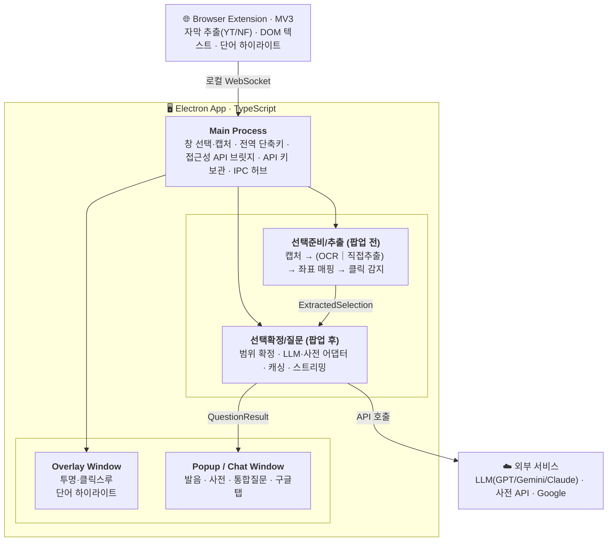

# Nuance — 외국어 콘텐츠 소비 보조 프로그램

> 화면 위 어떤 외국어 텍스트든 클릭 한 번으로, 그 맥락에 맞는 발음·뜻·뉘앙스를 즉시 알려주는 데스크톱 오버레이 도구.

몰입캠프 26s-w4-c3-07 팀 JoJo 프로젝트 repository.

---

## 목차

- [팀원](#팀원)
- [개요](#개요)
- [다운로드 및 실행](#다운로드-및-실행)
- [핵심 기능](#핵심-기능)
- [지원 언어](#지원-언어)
- [지원 콘텐츠](#지원-콘텐츠)
- [기술 아키텍처](#기술-아키텍처)
- [개발 환경 설정](#개발-환경-설정)
- [사용법](#사용법)
- [프로젝트 구조](#프로젝트-구조)
- [구현 현황](#구현-현황)
- [참고 문서](#참고-문서)

---

## 팀원

몰입캠프 26s-w4-c3-07 · 팀 JoJo

| 이름 | GitHub | 역할 |
|---|---|---|
| 조준호 | [milleion](https://github.com/milleion) | 앱 전반(선택/추출 파이프라인, LLM·사전 어댑터, UI, 설정) |
| 조예준 | [jossi-jossi](https://github.com/jossi-jossi) | 앱 전반(선택 모드·영역 탐지, OCR 파이프라인, UI/UX 개선) |

---

## 개요

외국어 원서·영상·웹소설을 볼 때 모르는 표현을 만나면 뷰어를 벗어나 사전·번역기로 이동해야 하고, 사전은 문맥 속 의미까지는 짚어주지 못한다. Nuance는 사용자가 보고 있는 창 위에 투명 오버레이를 띄워, 콘텐츠를 벗어나지 않고 단어를 클릭하면 문맥을 이해한 AI 답변을 받을 수 있게 한다. 텍스트를 직접 추출할 수 있으면 추출하고, 불가능하면(스캔본·이미지 전자책) OCR로 대응한다.

## 다운로드 및 실행

> TODO: GitHub Actions 배포 워크플로 세부 내용에 맞춰 추후 작성 (Releases 링크, OS별 다운로드 파일, 실행 방법).

소스에서 직접 빌드하려면 [개발 환경 설정](#개발-환경-설정)을 참고한다.

## 핵심 기능

- **창 하나만 고르면 끝** — Zoom 화면공유처럼 대상 창을 선택하면 앱은 트레이로 물러나고, 단축키로 언제든 선택 모드를 켜고 끌 수 있다.
- **문맥 인지형 발음/사전/통합 질문** — 선택한 표현의 발음(IPA/히라가나/병음 등, 다의어는 문맥 기반 발음 판정)과 사전 뜻(사전 API + AI의 문맥별 뜻 번호 판정), 자유 질문을 AI 채팅으로 받는다.
- **직접 추출 우선, OCR은 폴백** — 유튜브·넷플릭스 자막, 웹페이지 DOM, macOS 프리뷰 PDF(접근성 API)는 원문을 그대로 읽고, 스캔본·이미지 전자책만 OCR로 처리한다.
- **CJK 특화 처리** — 일본어/중국어는 언어별 형태소 분석기(Lindera/Sudachi, jieba/Intl.Segmenter/chinese-tokenizer)로 OCR 단어 재분할과 팝업 선택 단위를 의미 단위로 맞춘다.
- **자체 뷰어(PDF/EPUB/TXT)** — 외부 뷰어 접근성 API의 한계(좌표 미제공 등)를 피하기 위해 Nuance 내장 뷰어에서 원본 파일을 직접 추출한다.
- **브라우저 확장(MV3)** — 유튜브/넷플릭스 자막 추출, 일반 웹페이지 본문 DOM 추출(범용 본문 탐지), 선택 모드 단어 하이라이트를 로컬 WebSocket으로 앱과 연동한다.
- **GPT / Gemini / Claude 어댑터** — 설정에서 provider를 고르고 API 키만 등록하면 동작(키는 `safeStorage`로 로컬 암호화 저장, 외부 미전송).

## 지원 언어

언어는 기능 범위에 따라 3단계로 나뉜다.

| Tier | 언어 | OCR | AI 발음 | AI 사전 | 형태소 분석기 | 구글 검색 | 네이버 사전 |
|---|---|---|---|---|---|---|---|
| **tier1** | 영어·일본어·중국어(간체/번체), 4개 | ✅ 특화 OCR | ✅ | ✅ | ✅(일/중) | ✅ | ✅ |
| **tier2-A** | 30개 | ✅ 범용 OCR | ✅(IPA) | ❌ | ❌ | ✅ | ✅ |
| **tier2-B** | 25개 | ✅ 범용 OCR | ✅(IPA) | ❌ | ❌ | ✅ | ❌ |
| **tier3** | 그 외 전부 | ❌ | ❌ | ❌ | ❌ | ❌ | ❌ |

tier1(사전 API까지 포함한 전체 기능)만 언어별 사전 소스가 갖춰져 있고, tier2는 AI 발음·구글 검색까지는 동일하게 지원하되 AI 사전은 지원하지 않는다. OCR도 두 등급이 다르다 — tier1은 언어별 형태소 분석기(일본어 Lindera/Sudachi, 중국어 jieba 등)로 OCR 결과를 의미 단위 단어로 재분할하는 **특화 OCR**이고, tier2는 형태소 분석기가 없어 공백 기준(공백 없는 스크립트는 글자 단위)으로 처리하는 **범용 OCR**이다.

## 지원 콘텐츠

| 채널 | 대상 | 텍스트 확보 방식 |
|---|---|---|
| 데스크톱 | txt/epub | Nuance 자체 뷰어로 원본 파일 직접 추출 |
| 데스크톱 | PDF(macOS 프리뷰, 텍스트 레이어 있음) | 접근성 API(AX)로 텍스트+좌표 직접 획득 |
| 데스크톱 | PDF(그 외 뷰어·스캔본) | 추출 시도 → 텍스트 양으로 OCR 여부 판정 |
| 데스크톱 | Kindle/Apple Books | 접근성 API로 렌더 텍스트 추출 시도 → 실패 시 OCR |
| 데스크톱 | 스캔 소설 | OCR |
| 브라우저 | 유튜브 | URL 기반 원어 자막 추출 |
| 브라우저 | 넷플릭스 | 확장 프로그램으로 현재 에피소드 원어 자막 추출 |
| 브라우저 | 웹소설·웹툰·일반 웹페이지·PDF | 확장으로 DOM/텍스트 레이어 직접 추출 → 부족하면 OCR |

## 기술 아키텍처

전 구간 TypeScript 단일 언어로 구성해 이동 비용을 낮췄다.



- **앱**: Electron(메인 = Node, 렌더러/오버레이 = 웹) + TypeScript + React
- **캡처**: Windows는 win32 네이티브(`koffi` FFI) 우선, macOS는 `desktopCapturer` + CoreGraphics/AppKit 바인딩
- **OCR**: Tesseract.js(기본) + Python 상주 서버(DocLayout-YOLO 레이아웃 분류, PaddleOCR, 일본어 특화 Yomitoku/NDLOCR-Lite)
- **형태소 분석**: 일본어 Lindera/Sudachi, 중국어 jieba/Intl.Segmenter/chinese-tokenizer
- **확장 연동**: MV3 확장 ↔ Electron main, 로컬 WebSocket
- **사전 API**: 언어별 다단 폴백 체인(영어 Merriam-Webster→OEWN→Wiktionary, 일본어 daijisen→JMdict→Wiktionary, 중국어 汉典/萌典→CC-CEDICT→Wiktionary)
- **보안**: API 키는 Electron `safeStorage`로 로컬 암호화 저장

## 개발 환경 설정

### 요구 사항

- Node.js, npm
- (선택) Python 3.12 — 레이아웃 분류/PaddleOCR/일본어 특화 OCR을 쓰려면 필요. 없어도 앱은 정상 동작하며 해당 기능만 Tesseract 기본 경로로 폴백된다. 자세한 설정은 [python/README.md](python/README.md) 참고.

### 설치 및 실행

```bash
npm install
cp .env.example .env   # GPT/Gemini/Claude API 키, Merriam-Webster 키 등을 채운다(선택)
npm run dev
```

`predev` 훅이 사전 데이터(CC-CEDICT/OEWN/JMdict)와 폰트를 자동으로 내려받아 `resources/`에 채운다(최초 1회, 이후 멱등하게 스킵).

### 브라우저 확장 빌드

유튜브/넷플릭스 자막, 웹페이지 DOM 추출을 쓰려면 확장을 빌드해 브라우저에 로드해야 한다.

```bash
npm run build:ext   # 1회 빌드 (extension/dist/)
npm run watch:ext    # 감시 빌드
```

빌드된 `extension/dist/`를 크롬 등 Chromium 기반 브라우저의 "압축해제된 확장 프로그램 로드"로 등록한다. 자세한 내용은 [extension/README.md](extension/README.md) 참고.

### 주요 스크립트

| 명령 | 설명 |
|---|---|
| `npm run dev` | 개발 서버 실행 |
| `npm run build` | 프로덕션 빌드 |
| `npm run typecheck` | TypeScript 타입 검사 |
| `npm run lint` | ESLint 검사 |
| `npm run dist:mac` / `dist:win` / `dist:linux` | 플랫폼별 배포 패키징 |
| `npm run kill` | 개발 중 남은 Nuance 프로세스 종료 |

## 사용법

1. **창 선택** — 메인 화면의 "창 선택" 버튼으로 텍스트를 찾을 창(브라우저·PDF 뷰어 등)을 고른다. 앱은 트레이로 물러나고 대상 창은 계속 그대로 쓰면 된다.
2. **선택 모드 진입** — 모드 전환 단축키(기본 `` Alt+` ``)로 전환하면 대상 창 테두리가 파랑(일반) → 보라(선택 모드)로 바뀐다. 텍스트 위에 커서를 올리면 줄/단어가 하이라이트되고, 클릭하면 근방 텍스트가 담긴 팝업이 뜬다.
3. **팝업에서 질문하기** — 단어/드래그로 범위를 조정하고, 발음·사전 원샷 버튼이나 자유 입력창으로 AI에게 문맥 기반 답을 받는다. 자주 쓰는 질문은 등록해두고 재사용할 수 있다.
4. **PDF/EPUB/TXT 뷰어** — 메인 화면의 뷰어 버튼으로 파일을 열면 Nuance 자체 뷰어에서 바로 단어를 클릭해 팝업을 띄울 수 있다.
5. **트레이 메뉴** — 창 선택 전환/해제, 영역 수동 선택, OCR 강제 전환, 설정 등 대부분의 조작을 여기서 할 수 있다.

앱 안의 **설정 → 사용 설명서** 화면에서 언어 등급, 단축키(현재 저장된 실제 값), 문맥 범위, API 키 등록 방법을 포함한 전체 가이드를 확인할 수 있다.

## 프로젝트 구조

```text
JoJo/
├── src/
│   ├── shared/       # 공동 소유 — 타입·IPC 채널·언어 레지스트리·문맥 계산
│   ├── main/          # Electron 메인 프로세스
│   │   ├── selection/  # 선택 준비 & 추출 — 캡처·OCR·좌표 매핑·클릭 감지
│   │   ├── question/   # 선택 확정 & 질문 — LLM/사전 어댑터·채팅
│   │   ├── nlp/        # 언어별 형태소 분석 (일본어/중국어)
│   │   └── extension/  # 브라우저 확장 브릿지(로컬 WebSocket)
│   ├── preload/
│   └── renderer/       # React UI (메인/설정/팝업/뷰어 화면)
├── extension/          # 브라우저 확장(MV3) — 자막/DOM 추출, 하이라이트
├── python/             # 레이아웃 분류·OCR·형태소 분석 상주 서버
└── scripts/            # 사전 데이터/폰트 fetch, 빌드, 리소스 준비 스크립트
```

파이프라인은 **팝업창을 기준으로 두 영역**으로 나뉜다 — 팝업 전(창 선택·캡처·오버레이·추출)과 팝업 후(범위 확정·문맥 구성·질문·설정). 두 영역의 인터페이스 계약은 `ExtractedSelection`/`QuestionResult` 타입(`src/shared/types.ts`)으로 고정돼 있다.

## 구현 현황

유튜브/넷플릭스 자막, 일반 웹페이지 DOM 추출, LLM 3종 어댑터·스트리밍, 발음/사전(다중 소스 폴백)·통합 질문, 설정 화면, 언어 자동 감지(tier1+tier2)는 구현이 완료된 상태다. epub/PDF 직접 추출과 전자책 뷰어 접근성 API 등 일부 항목은 아직 진행 중이다.

## 참고 문서

- [extension/README.md](extension/README.md) — 브라우저 확장 개발 가이드
- [python/README.md](python/README.md) — 레이아웃/OCR/형태소 분석 Python 엔진 설정
